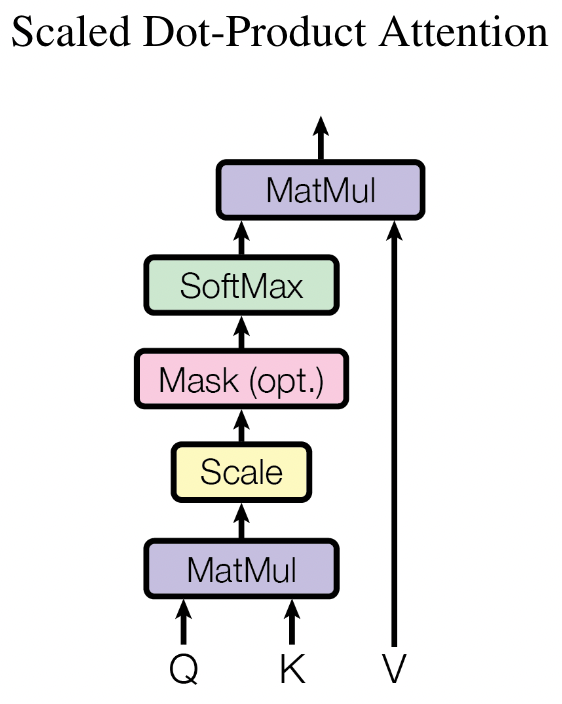
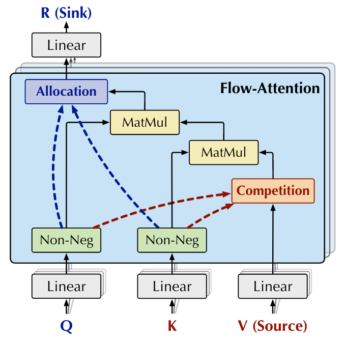
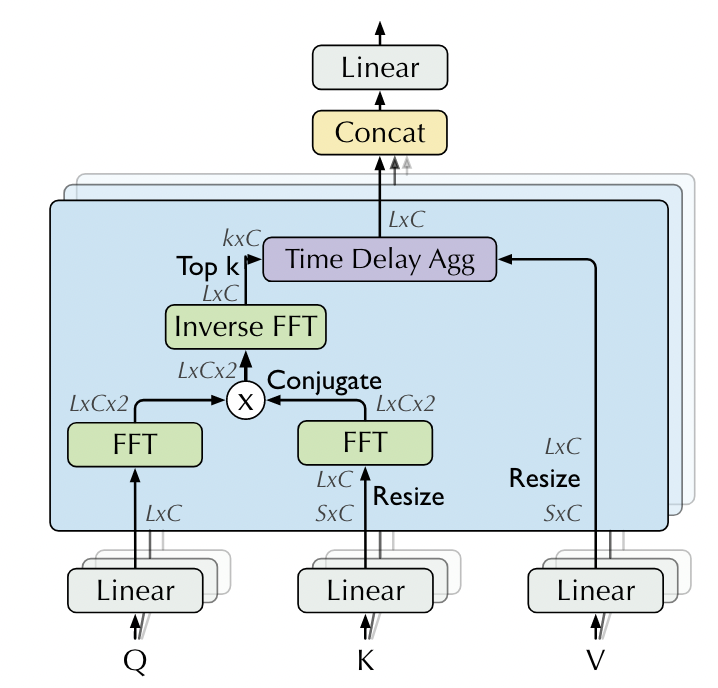

- Explore the performance of Transformer models with different attention mechanisms on long-sequence prediction tasks.
- The current experiment is mainly divided into two prediction tasks: predicting the future 24 data based on historical 96 data and predicting the future 168 data based on the historical 672 data.
- The model structure of each experimental object is exactly the same, only the attention mechanisms is different.
- Experiments are based on the ETTh1 dataset.

| Attention       | Task     | MSE    | MAE    | Time     |
|-----------------|----------|--------|--------|----------|
| FullAttention   | 96->24   | 0.6245 | 0.5777 | 8.8879   |
| ProbAttention   | 96->24   | 0.6160 | 0.5711 | 10.1303  |
| FlowAttention   | 96->24   | 0.7159 | 0.6312 | 9.4889   |
| AutoCorrelation | 96->24   | 0.4915 | 0.5217 | 22.9226  |
| FullAttention   | 672->168 | 1.3690 | 0.8561 | 38.1642  |
| ProbAttention   | 672->168 | 1.6498 | 0.9177 | 78.7496  |
| FlowAttention   | 672->168 | 1.1613 | 0.8313 | 140.3401 |
| AutoCorrelation | 672->168 | 1.5117 | 0.9110 | 140.3401 |

- FullAttention([Transformer](https://proceedings.neurips.cc/paper/2017/file/3f5ee243547dee91fbd053c1c4a845aa-Paper.pdf))
  

- ProbAttention([Informer](https://arxiv.org/pdf/2012.07436.pdf))

- FlowAttention([Flowformer](https://arxiv.org/pdf/2202.06258.pdf))
  

- AutoCorrelation([Autoformer](https://proceedings.neurips.cc/paper/2021/file/bcc0d400288793e8bdcd7c19a8ac0c2b-Paper.pdf))
  